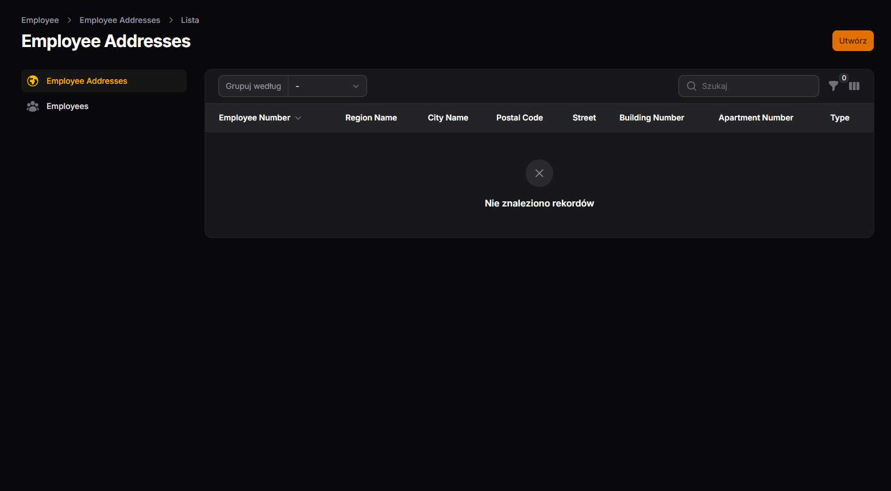
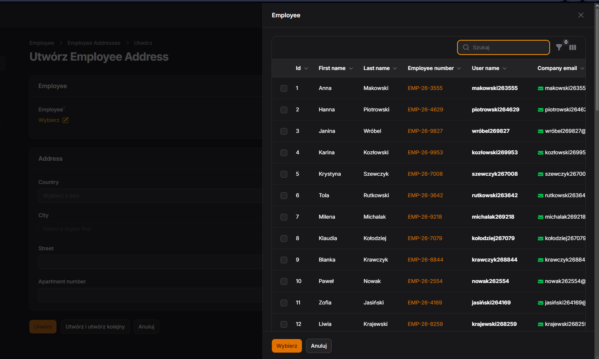
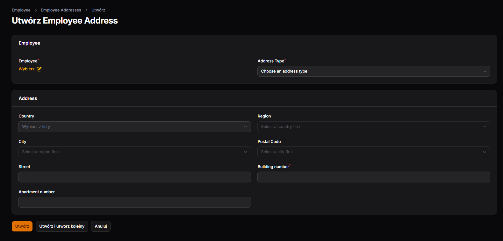
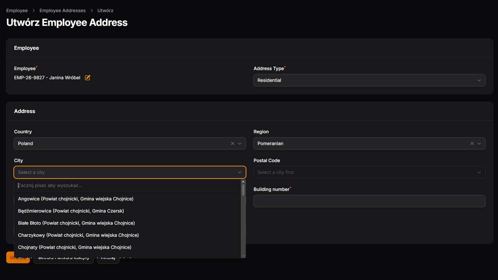
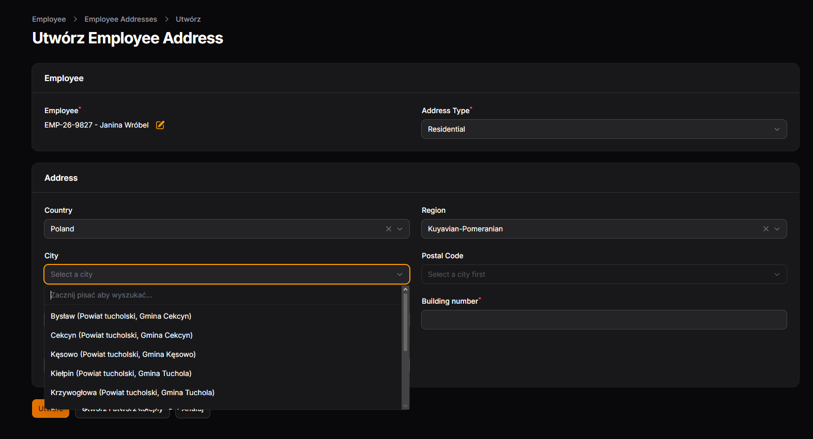
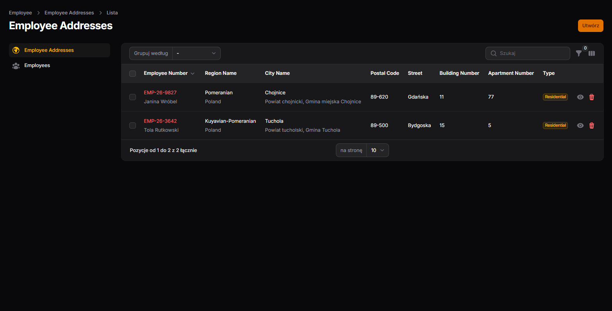
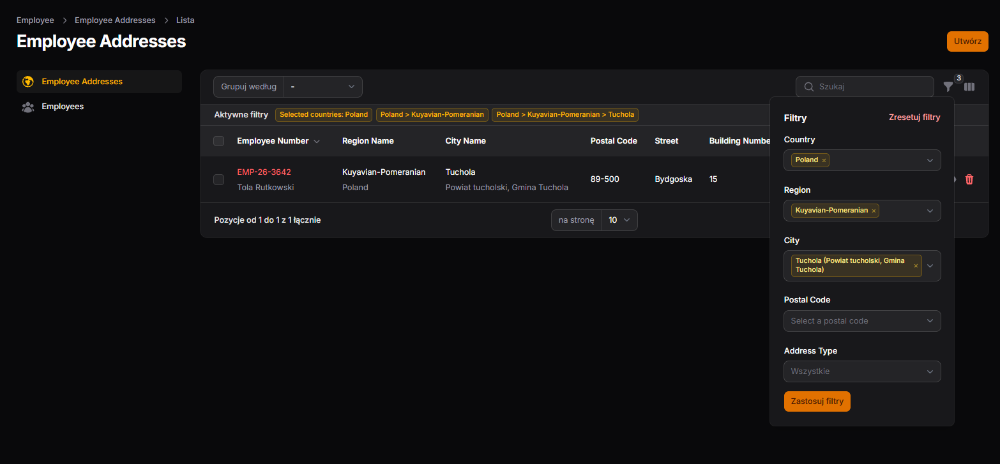

# pb_2026_tms_preview

💻**English:** ⬆️ [Readme](#english) | ⚖️ [License](#license-and-copyrights)
💻**Polski:** ⬆️ [Opis](#polski) | ⚖️ [Licencja](#licencja-i-prawa-autorskie)

---

## English

### 📌 1. About the Project
Hello. This is a demo version of the **TMS** (Transport Management System) project. 
This repository shows a part of a bigger system. It focuses only on the universal **Address Module** (`code_preview`) to show the architecture, clean code, and how address data works. A longer description of the files is in the section below.

### 2. 🛠️ Tech Stack

* 🚀 **Current version (`code_preview`):**
    * ⚙️ **Core technology:** `PHP 8+`, `Laravel 13+`
    * 🎨 **Admin panel:** `Filament 5+`, `guava/filament-knowledge-base`
    * 🛡️ **Permissions and security:** `bezhansalleh/filament-shield`, `spatie/laravel-permission`
    * 📖 **Documentation and API:** `Scribe` (API documentation generator)
    * 🐳 **Environment and tools:** `Docker` / `Laravel Sail`, `Debugbar`
    * 🗄️ **Database:** `MySQL` (managed with `HeidiSQL`)

* 📦 **Legacy / Old version (`old`):**
    * ⚙️ **Core technology:** `PHP 8+`, `Laravel 13+`
    * 🎨 **Admin panel:** `Filament 5+` (making simple CRUDs)
    * 💻 **Local environment:** `Laravel Herd` / `Laragon`
    * 🗄️ **Database:** `MySQL` (managed with `HeidiSQL`)

### 📂 3. Main Folder Structure

* **[`code_preview/`](./code_preview/)** - Current source code of the address module.
* **[`old/`](./old/)** - Older version with a smaller part of the whole TMS system. This folder also has the final ERD diagram for the project.
* **[`adress_module_erd.pdf`](./adress_module_erd.pdf)** - Detailed diagram of database relations for the address module.
* **[`img/`](./img/)** - Screenshots showing how the address module works.
* **[`LICENSE`](./LICENSE)** - MIT License

### 4. 🌍 Address Module

The main address module is clean and modular. Inside the [`code_preview/`](./code_preview) folder, you will find these areas:

* **Folder [`app/`](./code_preview/app/)** – contains the business logic:
    * **[`Enums/`](./code_preview/app/Enums/):** `AddressType`, `DivisionType`.
    * **[`Clusters/`](./code_preview/app/Filament/Clusters) (Filament):** Admin panel logic divided into parts:
        * **[`Employee/`](./code_preview/app/Filament/Clusters/Employee):** Area for employees. It has a pivot table and `EmployeeAddressResource`. You can add an address right from the employee form (without going to the registry), which makes data entry faster. You can copy this pattern for other parts like clients or suppliers.
        * **[`Registry/`](./code_preview/app/Filament/Clusters/Registry):** A place for dictionary data (used across the system because addresses are universal). It contains: `AddressResource`, `AdministrativeDivisionResource`, `CityResource`, `CountryResource`, `CountryRegionResource`, `PostalCodeResource`.
    * **[`Schema/`](./code_preview/app/Filament/Schemas) (Filament):** Has one file [`AddressSchema.php`](./code_preview/app/Filament/Schemas/AddressSchema.php) with reusable methods for form logic, field cascading (e.g., choosing a country filters regions and cities), and advanced table filters.
    * **[`Models/`](./code_preview/app/Models):** Eloquent models connected to the resources above.
    * **[`Polices/`](./code_preview/app/Polices):** Authorization policies to manage permissions for CRUDs and pages directly from the admin panel.

* **Folder [`database/`](./code_preview/database)** – manages data:
    * **[`migrations/`](./code_preview/database/migrations):** Table migrations.
    * **[`seeders/`](./code_preview/database/seeders):** Main seeders (`CountrySeeder` and `CountryRegionSeeder`) for base dictionary data.
    * **[`factories/`](./code_preview/database/factories):** Three factories (`AddressFactory`, `CityFactory`, `PostalCodeFactory`) from an early stage when data was generated automatically (now unused).

### 📦 5. Older System Version (Legacy / `old`)

In the **[`old/`](./old/)** folder and the root directory, you can find an older version and documentation from earlier work on the TMS system:

* **[`app_resources/`](./old/app_resources/)** – contains a small set of resources:
    * **[`Addresses/`](./old/app_resources/Addresses):** Older address code, including [`AddressFields.php`](./code_preview/app_resources/AddressFields.php), which is the old version of `AddressSchema`.
    * **[`EmployeeDocuments/`](./old/app_resources/EmployeeDocuments):** Employee document resources.
    * **[`Vehicles/`](./old/app_resources/Vehicles):** Vehicle resources.
* **[`migrations/`](./old/migrations/)** – old migrations for tables: `addresses`, `employees`, `employee_documents`, `vehicles`, and `vehicle_cargo_tank_details`.
* **[`models/`](./old/models/)** – models for the tables above: `Address`, `Employee`, `EmployeeDocument`, `Vehicle`, and `VehicleCargoTankDetail`.
* **[`database_schema`](./database_schema)** – the final project diagram, made from the full database using reverse engineering in `MySQL Workbench`.
* **[`presentation`](./presentation)** – a PDF file showing the tables and forms mentioned above.

### 6. 🖼️ Screenshots of the Address Module and Employee Link

The screenshots below show the key views of linking an address to an employee (e.g., a driver) using a pivot table in the admin panel.

#### I. EmployeeAddress Table View
* **Description:** A pivot table showing the link between an address and an employee. You can choose a predefined address type. The screenshot shows an empty table.
* 🔗 ****

#### II. Adding a Record
* **IIa. Adding to a driver:** Selecting a driver from a dropdown list inside the address form. Driver data was generated using a factory.
  * 🔗 ****
* **IIb. Adding address data:** Entering basic address details (street, building number, etc.).
  * 🔗 ****
* **IIc. Showing field cascading in the form:** Presenting cascading field dependencies (e.g., selecting a country automatically filters available regions/provinces, cities, and postal codes). The screenshots below show this using the example of a region (Pomeranian / Kuyavian-Pomeranian).
  * 🔗 ****
  * 🔗 ****

#### III. Result After Adding
* **Description:** List or detail view after successfully saving the record in the database, confirming the correct assignment of the address to the driver.
* 🔗 ****

#### IV. Table Filter
* **Description:** Using advanced filters in the Filament table (e.g., filtering addresses by `AddressType`, selected country, region, etc.). The screenshot shows an example of the table after filtering by the city "Tuchola". The state before is shown in point `III`.
* 🔗 ****

### 7. 🔌 How to Run It in Your Own Project

Because this repository gives you the source code (`code_preview`), running the module in your app is easy, but you need the right folder structure. Just move the files and set up your environment:

1. **Copy the folder structure:**  
   Copy the contents of the `code_preview/` folder (`app/`, `database/`, etc.) directly into the root folder of your Laravel app. Make sure to keep the original paths so that PSR-4 namespaces work right (e.g., `App\Filament\Clusters\...`).

2. **Fix namespaces (optional):**  
   If your project uses a different main namespace, make sure your PHP files have the correct `namespace` and `use` lines.

3. **Run database migrations:**  
   Move the migration files to the `database/migrations` folder in your project and run this command in your terminal to create the tables:
    ```bash
   php artisan migrate

4. **Initializing Dictionary Data (Seeders):**
   Add the main seeder (`CountrySeeder`) to the `database/seeders/DatabaseSeeder.php` file in your app (`CountryRegionSeeder` is called inside `CountrySeeder`)
   ```php
   // database/seeders/DatabaseSeeder.php
   public function run(): void
   {
       $this->call([
           CountrySeeder::class,
           // Other seeders...
       ]);
   }

### 8. 🛠️ Known Issues and Technical Notes

* **1. Search errors for some items:** In this preview version, searching for certain elements may sometimes cause errors with specific queries. This will be fixed in future updates.
* **2. No custom error handling (Intentional for now):** The system doesn't have custom user error messages yet. Laravel and Filament default error screens were kept on purpose during testing and preview so we can instantly see the exact error location and debug issues easily.
* **3. No limits on municipalities and districts for cities (Intentional design):** Hard limits were left out on purpose because some large cities (like metropolitan areas) can cover multiple municipalities or administrative districts.

### 9. 🎯 Address Module Goals (Roadmap)

The main development goals for the address module are:

* **Error handling and validation:** Adding exception handling when users put in wrong or incomplete address data.
* **Unit and integration tests (PHPUnit):** Writing automated PHP tests for the schema logic and model relations.
* **Data import module:** Adding a universal way to import dictionary data (regions, cities, postal codes, countries) from external files, especially **XML** and **JSON**.
* **Data export module:** Adding a way to export dictionary data just like above to **JSON**.
* **Translations:** Adding multi-language support.

### 9. 🔮 Future Plans (Full TMS Project Roadmap)

The full TMS system goes beyond just the address module. You can check the target look, scale, and relations in the old ERD diagram (in the [`old/`](./old/) folder). Future steps include these main logistics features:

* **Resource management expansion:** A full employee system (for drivers, dispatchers, logistics) with work schedules, payroll, and documents (licenses, medical checks, contracts).
* **Fleet management:** An advanced module for vehicles and trailers to track inspections, insurance, costs, and specs (like cargo tank details).
* **Orders and forwarding module:** Creating, assigning, and invoicing transport orders connected directly to client lists and the address database.
* **OpenStreetMap integration (Live Map):** Adding a real-time live map using **OpenStreetMap** to:
    * See current or recent locations of drivers and trucks.
    * Check and view planned transport routes.
    * Monitor order progress right from the admin panel.
* **Light mobile/web app for drivers:** A simple interface (PWA or light app) for drivers on the road to quickly report order statuses, send documents (like proof of delivery), and update GPS positions.

### License and Copyrights

© 2026 Piotr Ott. Demonstration project (`pb_2026_tms_preview`) created for architectural, showcase, and recruitment purposes – the entire project is licensed under the MIT License (see the [`LICENSE`](./LICENSE) file).

---

## Polski

### 📌1.O projekcie
Witaj. Jest to wersja demonstracyjna projektu **TMS** (Transport Management System)
To repozytorium prezentuje wycinek większego systemu, skupia się wyłącznie na przedstawieniu uniwersalnego **Modułu Adresów**(`code_preview`), aby pokazać architekturę, czystość kodu oraz obsluge danych adresowych. Dłuży opis poszczególnych plików znajduję się w poniższej sekcji.

### 2.🛠️Tech Stack

* 🚀 **Aktualna wersja (`code_preview`):**
    * ⚙️ **Technologia bazowa:** `PHP 8+`, `Laravel 13+`
    * 🎨 **Panel administracyjny:** `Filament 5+`, `guava/filament-knowledge-base`
    * 🛡️ **Uprawnienia i autoryzacja:** `bezhansalleh/filament-shield`, `spatie/laravel-permission`
    * 📖 **Dokumentacja i API:** `Scribe` (generator dokumentacji API)
    * 🐳 **Środowisko i narzędzia:** `Docker` / `Laravel Sail`, `Debugbar`
    * 🗄️ **Baza danych:** `MySQL` (zarządzanie przez `HeidiSQL`)

* 📦 **Legacy / Wersja poprzednia (`old`):**
    * ⚙️ **Technologia bazowa:** `PHP 8+`, `Laravel 13+`
    * 🎨 **Panel administracyjny:** `Filament 5+` (generowanie prostych crudów)
    * 💻 **Środowisko lokalne:** `Laravel Herd` / `Laragon`
    * 🗄️ **Baza danych:** `MySQL` (zarządzanie przez `HeidiSQL`)

### 📂3.Struktura głównego katalogu repozytorium

* **[`code_preview/`](./code_preview/)** - Aktualny kod źródłowy samodzielnego modułu adreesów.
* **[`old/`](./old/)** - Starsza wersja, która zawiera mniejszy wycinek, lecz całego systemu tms. W katalogu również się znajduje docelowy diagram erd całego projektu. 
* **[`adress_module_erd.pdf`](./address_module_erd.pdf)** - Szczegółowy diagram ERD relacji encji dla aktualnego modułu adresów.
* **[`img/`](./img/)** - Zrzuty ekranu prezentujące działanie modułu adresów.
* **[`LICENSE`](./LICENSE)** - Licencja MIT

### 4.🌍Moduł adresów

Główny moduł adresowy został zaprojektowany w sposób czysty i modularny. W folderze [`code_preview/`](./code_preview) znajdziesz następujące obszary:

* **Folder [`app/`](./code_preview/app/)** – zawiera logikę biznesową aplikacji:
    * **[`Enums/`](./code_preview/app/Enums/):** `AddressType`, `DivisionType`.
    * **[`Clusters/`](./code_preview/app/Filament/Clusters) (Filament):** Podział logiki panelu administracyjnego na niezależne obszary:
        * **[`Employee/`](./code_preview/app/Filament/Clusters/Employee):** Obszar dedykowany pracownikom, zawiera tabelę łącznikową i zasób powiązany z pracownikiem (`EmployeeAddressResource`). Umożliwia dodawanie adresu bezpośrednio z poziomu formularza pracownika (bez wchodzenia do rejestru), co automatyzuje wprowadzanie danych. Stanowi on wzorzec implementacyjny do powielenia w innych sekcjach systemu (np. klienci, dostawcy).
        * **[`Registry/`](./code_preview/app/Filament/Clusters/Registry):** Uniwersalne miejsce przechowujące dane słownikowe (wykorzystywane wielokrotnie w różnych miejscach systemu z racji uniwersalności adresu). Jest to sekcja zbiorcza zawierająca zasoby (tabele i formularze): `AddressResource`, `AdministrativeDivisionResource`, `CityResource`, `CountryResource`, `CountryRegionResource`, `PostalCodeResource`.
    * **[`Schema/`](./code_preview/app/Filament/Schemas) (Filament):** Zawiera pojedynczy plik [`AddressSchema.php`](./code_preview/app/Filament/Schemas/AddressSchema.php), w którym wydzielono metody wielokrotnego użytku odpowiadające za logikę biznesową formularzy i kaskadowość pól (np. powiązanie kraju z regionem, miasta z kodem pocztowym) oraz zaawansowane filtry tabel w panelu.
    * **[`Models/`](./code_preview/app/Models):** Modele Eloquent (Laravel) powiązane ze wszystkimi wyżej wymienionymi zasobami.
    * **[`Polices/`](./code_preview/app/Polices):** Pliki polityk autoryzacji wygenerowane w celu zarządzania uprawnieniami do poszczególnych CRUD-ów i podstron bezpośrednio z panelu administratora.

* **Folder [`database/`](./code_preview/database)** – zarządza warstwą danych:
    * **[`migrations/`](./code_preview/database/migrations):** Uporządkowane migracje tabel.
    * **[`seeders/`](./code_preview/database/seeders):** Główne seedery systemowe (w tym `CountrySeeder` i `CountryRegionSeeder`), które inicjalizują bazowe dane słownikowe.
    * **[`factories/`](./code_preview/database/factories):** Wybrane trzy fabryki (`AddressFactory`, `CityFactory`, `PostalCodeFactory`) zachowane z wczesnego etapu projektu, gdzie dane były uzupełniane automatycznie (obecnie na tym etapie są już zbędne i nieużywane).

### 📦 5. Starsza wersja systemu (Legacy / `old`)

W katalogu **[`old/`](./old/)** oraz w głównym katalogu znajduje się starsza wersja projektu i dokumentacja pomocnicza przedstawiająca wcześniejszy etap prac nad systemem TMS:

* **[`app_resources/`](./old/app_resources/)** – zawiera niewielki zestaw zasobów powiązanych bezpośrednio z poniższymi migracjami i modelami:
    * **[`Addresses/`](./old/app_resources/Addresses):** Wcześniejsza implementacja komponentów adresowych (w tym plik [`AddressFields.php`](./old/code_preview/app_resources/AddressFields.php), który stanowi poprzednią wersję pliku `AddressSchema` znanego z aktualnej sekcji).
    * **[`EmployeeDocuments/`](./old/app_resources/EmployeeDocuments):** Zasoby powiązane z dokumentami pracowników.
    * **[`Vehicles/`](./old/app_resources/Vehicles):** Zasoby powiązane z sekcją pojazdów.
* **[`migrations/`](./old/migrations/)** – historyczne migracje bazodanowe tworzące tabele: `addresses`, `employees`, `employee_documents`, `vehicles` oraz `vehicle_cargo_tank_details`.
* **[`models/`](./old/models/)** – powiązane modele Eloquent dla powyższych encji: `Address`, `Employee`, `EmployeeDocument`, `Vehicle` oraz `VehicleCargoTankDetail`.
* **[`database_schema`](./database_schema)** – docelowy diagram całego projektu, wygenerowany na podstawie kompletnej bazy danych metodą inżynierii wstecznej (*reverse engineering*) przy pomocy `MySQL Workbench`.
* **[`presentation`](./presentation)** – plik PDF przedstawiający omówinone powyżej tabele i formularze systemu.

### 6. 🖼️ Zrzuty ekranu prezentujące moduł adresowy i powiązanie z pracownikiem

Poniższe zrzuty ekranu przedstawiają kluczowe widoki powiązania adresu z pracownikiem (np. kierowcą) za pomocą tabeli łącznikowej w panelu administracyjnym.

#### I. Widok tabeli EmployeeAddress
* **Opis:** Tabela łącznikowa prezentująca powiązanie adresu z pracownikiem Mamy możliwość wybrania predefiniowanego typu adresu. Screeenshot przedstawia pusta tabele.
* 🔗 ****

#### II. Dodawanie rekordu
* **IIa. Dodawanie do kierowcy:** Wybór kierowcy z rozwijanej tablicy w formularzu adresu. Dane kierowców są wygenerowane za pomocą fabryki
  * 🔗 ****
* **IIb. Dodawanie adresu:** Wprowadzanie podstawowych danych adresowych (ulica, numer budynku itp.).
  * 🔗 ****
* **IIc. Pokazanie kaskadowości w formularzu:** Prezentacja kaskadowego powiązania pól (np. wybór kraju automatycznie filtruje dostępne regiony/województwa oraz miasta i kody pocztowe) Poniższe screenshoty pokazują to na przykładzie województwa (pomorskie/kujawsko pomorskie).
  * 🔗 ****
  * 🔗 ****

#### III. Wynik po dodaniu
* **Opis:** Widok listy lub podglądu po pomyślnym zapisaniu rekordu w bazie danych, potwierdzający poprawne przypisanie adresu do kierowcy.
* 🔗 ****

#### IV. Pokaz filtra
* **Opis:** Działanie zaawansowanych filtrów w tabeli Filament (np. filtrowanie adresów po typie adresu `AddressType` lub wybranym kraju, województwie itp.) Na screenie przykład tabeli po zastosowaniu filtra po mieście `Tuchola`. Stan przed w punkcie `III`.
* 🔗 ****

### 7. 🔌 Wdrożenie i uruchomienie we własnym projekcie

Ponieważ to repozytorium prezentuje gotowy wycinek kodu źródłowego (`code_preview`), uruchomienie modułu we własnej aplikacji jest proste, ale wymaga zachowania odpowiedniej struktury. Wystarczy przenieść pliki i zsynchronizować środowisko:

1. **Przeniesienie struktury katalogów:**
   Skopiuj zawartość folderu `code_preview/` (foldery `app/`, `database/` itp.) bezpośrednio do głównego katalogu (*root*) swojej docelowej aplikacji Laravel. Upewnij się, że zachowujesz oryginalną strukturę ścieżek, aby przestrzenie nazw (*namespaces*) zgodne z PSR-4 działały poprawnie (np. `App\Filament\Clusters\...`).

2. **Dopasowanie przestrzeni nazw (opcjonalnie):**
   Jeśli Twój projekt ma inną nazwę głównego namespace niż ten w kodzie podglądu, upewnij się, że pliki PHP posiadają poprawne dyrektywy `namespace` oraz `use`.

3. **Wykonanie migracji bazodanowych:**
   Przenieś pliki migracji do folderu `database/migrations` w swoim projekcie i wykonaj polecenie w terminalu, aby utworzyć wymagane tabele:
   ```bash
   php artisan migrate

4. **Inicjalizacja danych słownikowych (Seedery):**
   Dodaj główny seeder (`CountrySeeder`) do pliku `database/seeders/DatabaseSeeder.php` w swojej aplikacji (`CountryRegionSeeder` jest wywoływany wewnąrz `CountrySeeder`)
   ```php
   // database/seeders/DatabaseSeeder.php
   public function run(): void
   {
       $this->call([
           CountrySeeder::class,
           // inne Twoje seedery...
       ]);
   }

### 8. 🛠️ Błedy i uwagi techniczne

* **1. Błędy wyszukiwania niektórych elementów:** W obecnej wersji podglądu wyszukiwanie w wybranych polach może sporadycznie generować wyjątki przy specyficznych zapytaniach. Zostanie to poprawione w kolejnych wersjach.
* **2. Brak pełnej obsługi wyjątków (Celowe w aktualnej wersji):** System nie posiada jeszcze dedykowanej obsługi błędów użytkownika, celowo pozostawiono domyślne komunikaty wyjątków Laravela oraz Filamenta, aby w fazie testów i podglądu kodu natychmiast widzieć dokładne miejsce błędu i precyzyjnie diagnozować problemy.
* **3. Brak twardego limitu gmin i powiatów dla miasta (Decyzja celowa):** Celowo zrezygnowano z sztywnych ograniczeń liczebności przypisań, ponieważ wybrane duże miasta (np. aglomeracje) mogą obejmować kilka gmin lub specyficznych dzielnic o charakterze administracyjnym.

### 9. 🎯 Cele i założenia modułu adresowego (Roadmapa modułu)

Główne cele rozwojowe dla modułu adresowego obejmują:

* **Obsługa błędów i walidacja:** Wdrożenie mechanizmów obsługi wyjątków przy wprowadzaniu błędnych lub niepełnych danych adresowych.
* **Testy jednostkowe i integracyjne (PHPUnit):** Pokrycie kluczowej logiki biznesowej schematów oraz relacji modelowych testami automatycznymi w PHP.
* **Moduł importu danych:** Dodanie uniwersalnego mechanizmu importu danych słownikowych (województwa, miasta, kody pocztowe, kraje) z różnych formatów plików zewnętrznych, ze szczególnym uwzględnieniem **XML** oraz **JSON**
* **Moduł eksportu danych:** Dodanie mechanizmu eksportu danych słownikowych tak jak powyżej do formatu **JSON**
* **Tłumaczenia:** Dodanie tlumaczeń.

### 10. 🔮 Plany przyszłościowe (Roadmapa całego projektu TMS)

Rozwój docelowego systemu TMS wykracza poza sam moduł adresowy. Docelowy wygląd, skala oraz pełna architektura powiązań całego systemu znajdują się w starym diagramie ERD (dostępnym w katalogu [`old/`](./old/)). W kolejnych etapach projektowych planowane jest wdrożenie kluczowych komponentów logistycznych:

* **Rozbudowa modułu zarządzania zasobami:** Pełny system obsługi pracowników (kierowców, spedytorów, logistyków), obejmujący harmonogramy pracy, rozliczenia oraz ewidencję dokumentów (uprawnienia, badania, umowy).
* **Zarządzanie flotą:** Zaawansowany moduł do obsługi pojazdów i naczep, kontrolowania przeglądów, ubezpieczeń, kosztów eksploatacyjnych oraz szczegółowych parametrów technicznych (np. specyfikacja cystern cargo).
* **Moduł zleceń i spedycji:** Tworzenie, przydzielanie i fakturowanie zleceń transportowych zintegrowane bezpośrednio z kartotekami klientów oraz bazą adresową.
* **Integracja z OpenStreetMap (Live Map):** Wdrożenie interaktywnej mapy czasu rzeczywistego (live map) opartej na **OpenStreetMap**, umożliwiającej:
    * Podgląd aktualnych lub ostatnich lokalizacji kierowców i ciężarówek.
    * Wizualizację i weryfikację zaplanowanych tras transportowych.
    * Monitorowanie postępów realizacji zleceń bezpośrednio z poziomu panelu menedżerskiego.
* **Lekka aplikacja mobilna / webowa dla kierowców:** Dedykowany, uproszczony interfejs (PWA lub lekka aplikacja) dla kierowców w trasie, służący do szybkiego raportowania statusów zleceń, przesyłania dokumentów (np. potwierdzeń dostawy) oraz aktualizacji pozycji GPS.

### Licencja i prawa autorskie
© 2026 Piotr Ott. Projekt demonstracyjny (`pb_2026_tms_preview`) stworzony w celach architektonicznych, pokazowych i rekrutacyjnych - całość jest na licencji MIT (zobacz plik [`LICENSE`](./LICENSE)).
